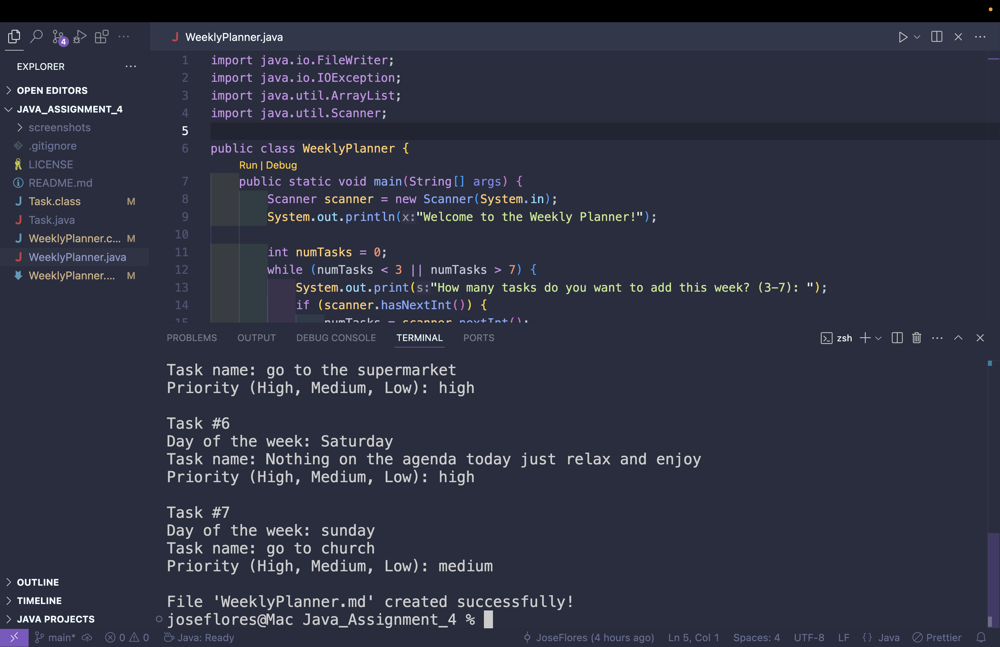
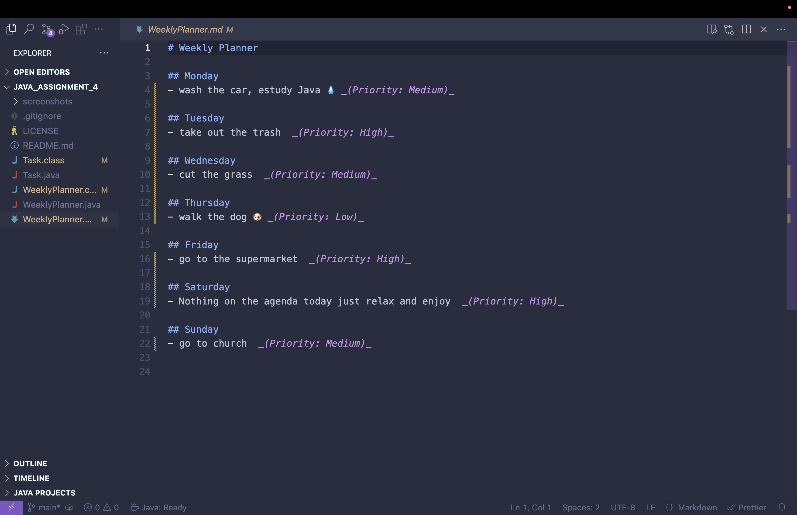

# Weekly Planner App

## Description
Weekly Planner App is a simple Java utility that helps users organize their weekly tasks.  
You can add between 3 and 7 tasks, assign priorities (High, Medium, Low), and the app automatically generates a **Markdown (.md)** file with your tasks and relevant emojis based on keywords in the task description.

## Features
- Add 3–7 tasks per week.  
- Assign task priorities: High, Medium, Low.  
- Automatically adds emojis depending on the task:
  - 💧 Wash  
  - 🍽️ Eat / Cook  
  - 🐶 Dog  
  - 🏃 Run / Gym / Exercise  
  - 📚 Study / Read / Java  
  - 🚗 Car  
  - 🛒 Shop / Buy  
  - 🧹 Clean  
  - 💦 Water  
  - 📞 Call  
  - 🛌 Sleep / Nap  
  - 🎵 Music / Listen  
- Generates a clean, readable **Markdown file** (`WeeklyPlanner.md`) with tasks organized by day and sorted by priority (High → Medium → Low).  

## Installation

### 1. Compile
Run this command in your terminal:

```bash
javac WeeklyPlanner.java
```

### 2. Run from terminal
java WeeklyPlanner

### 3. Optional: Create a Mac .app for double-click execution
# Create an executable jar
jar cfe WeeklyPlanner.jar WeeklyPlanner *.class

	•	c → create a jar
	•	f → specify the file name
	•	e → specify the main class (WeeklyPlanner)
  Run it using:

  java -jar WeeklyPlanner.jar
  
# Then use Automator on Mac to create an application that runs this jar

  1.	Open Automator → select Application.
	2.	Add the action “Run Shell Script”.
	3.	Enter the following in the shell script:
  ```bash
  cd /path/to/your/project
java -jar WeeklyPlanner.jar

	4.	Save the application as WeeklyPlanner.app.
	5.	Now you can double-click to run your Java app.


### 4 Example Usage

(Optional) Change the Icon
	•	Right-click the .app → Get Info
	•	Drag a .icns icon onto the top-left icon to customize it.

### 5 Example Usage

# Terminal Input:
Welcome to Weekly Planner!
How many tasks do you want to add? (3-7): 3

Task 1 name: Wash the car
Priority (High, Medium, Low): High

Task 2 name: Study Java
Priority (High, Medium, Low): Medium

Task 3 name: Go to the gym
Priority (High, Medium, Low): Low

### Generated Markdown (WeeklyPlanner.md):

# Weekly Planner

## Monday
- 💧 Wash the car _(Priority: High)_
- 📚 Study Java _(Priority: Medium)_
- 🏃 Go to the gym _(Priority: Low)_

## Screenshots




⸻

Author 

Jose Flores — 2025

⸻

License

This project is open-source and free to use.
